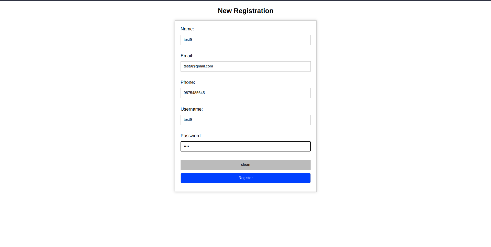

# Krishak_Gyan: Your Agricultural Companion 🌱

Krishak_Gyan is a comprehensive agricultural information and recommendation system designed to empower farmers and enthusiasts with data-driven insights. From crop predictions and recommendations to detailed information about crops based on location and season, Krishak_Gyan has you covered. Additionally, it offers personalized fertilizer recommendations to optimize crop yield.
## home

## home2

## database

## hregistration

## hsucess

## otp

## home


## Features 🚀

* **Crop Prediction and Recommendation:** Krishak_Gyan uses machine learning to predict the best crops to grow in a particular region and season. It also provides recommendations on the right fertilizers and pesticides to use for optimal crop yield.

* **Location-Specific Crop Information:** Krishak_Gyan provides detailed information about crops, such as their growth requirements, pest and disease control, and harvesting methods. This information is specific to the farmer's location, so they can be sure that they are getting the best advice for their crops.

* **Seasonal Insights:** Krishak_Gyan provides information on the climate and weather conditions in different seasons. This helps farmers to plan their crop cultivation accordingly.

* **Fertilizer Recommendations:** Krishak_Gyan provides personalized fertilizer recommendations based on the crops that the farmer is growing. This helps to ensure that the crops are getting the nutrients they need to thrive.

* **User-Friendly Frontend:** Enjoy a seamless user experience with HTML, JavaScript, CSS, and Bootstrap.

* **Robust Backend:** Powered by PHP and MySQL for secure and efficient data management.

* **Machine Learning Magic:** Utilizes Python3 with RandomForest to deliver cutting-edge predictions.

## Prerequisites 🛠️

Before getting started, ensure you have the following prerequisites in place:

* **Python Libraries:**
    * [pandas](https://pandas.pydata.org/) (for CSV file handling)
    * [scikit-learn](https://scikit-learn.org/) (for building the RandomForest model)

* **Local Server:**
    * [XAMPP](https://www.apachefriends.org/index.html) or any other local server (for PHP backend).

* **Database:**
    * [MySQL](https://www.mysql.com/) or [phpMyAdmin](https://www.phpmyadmin.net/) (for handling login, signup, and other database-related details).

## Installation 📥

1. **Clone this repository** to your local machine:

    ```bash
    git clone https://github.com/Krrish9783/Krishak_Gyan.git
    ```

2. **Access the application:**
    * Open your web browser and navigate to `localhost/Project`.

## Usage 🌟

1. Launch Krishak_Gyan in your web browser.
2. Enter the necessary details such as location and season to receive crop predictions and recommendations.
3. Explore crop information by state, district, and season.
4. Receive personalized fertilizer recommendations based on selected crops.

## Contributing 🤝

We welcome contributions from the community. If you'd like to contribute to Krishak_Gyan, please 
1. Create a pull request to the main repository.

## Impact on Farmers 🌾

Krishak_Gyan has had a significant impact on farmers. It has helped them:

* Increase crop yields by providing accurate crop recommendations and fertilizer schedules.
* Reduce the risk of crop failure by providing information on climate and weather conditions.
* Improve farming practices by giving access to the latest agricultural research.

## Future Plans 🚧

Krishak_Gyan is continuously evolving. Our future plans include:

* Adding a weather forecast feature to provide farmers with real-time weather updates.
* Developing a pest and disease identification tool for early pest management.
* Expanding language support to reach farmers

## License 📜

This project is licensed under the MIT License.

## Contact 📬

For any questions or inquiries, please contact 9173551395 (Kishnu).
